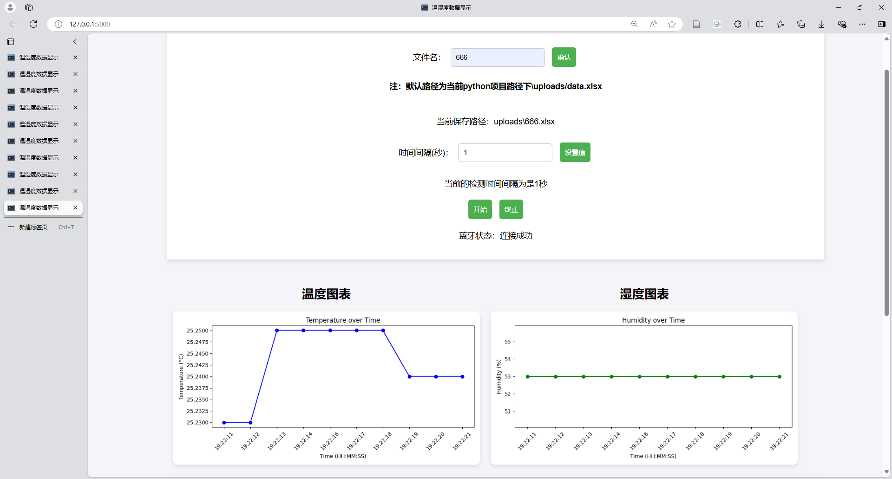
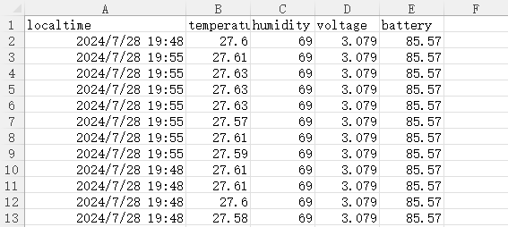

## 小米温度计数据读取并在网页显示

### 项目概述

这是一个基于Python的Web应用，用于通过蓝牙连接小米温度计设备，实时监测并记录环境温湿度数据。系统将数据存储在Excel文件中，并通过Web界面提供实时数据展示、图表可视化和控制功能。

excel默认保存路径：./uploads/data.xlsx

**需要自己修改温度计设备MAC地址：在`getdata.py`中修改`Mac`变量**

### 功能展示
- 可在网页修改保存文件名
- 可在网页设置保存数据的间隔 单位秒
- 修改保存路径和其他设置需要从源代码修改
- （前后端小白，代码功能简单）
#### 网页页面

#### 数据保存

